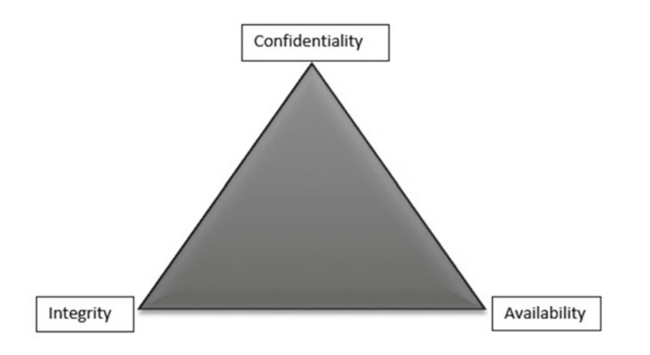

Confidentiality, integrity, and availability, often known as the CIA triad, are the building blocks of information security.

Any attack on an information system will compromise one, two, or all three of these components. Based on which of these components is being compromised the most, efficient security controls can be designed accordingly.

## Confidentiality

In simple terms, confidentiality means something that is secret and is not supposed to be disclosed to unintended people or entities.

Confidentiality ensures that sensitive information is accessed only by an authorized person and kept away from those not authorized to possess them.

Everyone has information which they wish to keep secret. Thus Protecting such information is an important part of information security.

### Examples of confidential information:

*   Bank account statements
*   Personal information
*   Credit card numbers
*   Trade secrets
*   Government documents

In the event that confidentiality is compromised, it might result in unauthorized access to personal information or even complete loss of privacy!

### Examples of attacks that affect confidentiality:

*   Packet sniffing
*   Password cracking
*   Dumpster diving
*   Wiretapping
*   Keylogging
*   Phishing

### Ways to ensure confidentiality:

*   Usernames and passwords
*   Two-factor authentication
*   Biometric verification
*   Security tokens or key fobs
*   Data encryption

## Integrity

In the context of the information security (InfoSec) world, integrity means that when a sender sends data, the receiver must receive exactly the same data as sent by the sender.

Data must not be changed in transit. For example, if someone sends a message “Hello!”, then the receiver must receive “Hello!” That is, it must BE exactly the same data as sent by the sender. Any addition or subtraction of data during transit would mean the integrity has been compromised.

### Example attacks that affect Integrity:

*   Salami attack
*   Data diddling attacks
*   Session hijacking
*   Man-in-the-middle (MITM) attack

## Availability

Availability implies that information is available to the authorized parties whenever required. Unavailability to data and systems can have serious consequences.

It is essential to have plans and procedures in place to prevent or mitigate data loss as a result of a disaster. A disaster recovery plan must include unpredictable events such as natural disasters and fire.

A routine backup job is advised in order to prevent or minimize total data loss from such occurrences.

Also, extra security equipment or software such as firewalls and proxy servers can guard against downtime and unreachable data due to malicious actions such as denial-of-service (DoS) attacks and network intrusions.

### Example attacks that affect Availability:

*   DoS and DDoS attacks
*   SYN flood attacks
*   Physical attacks on server infrastructure